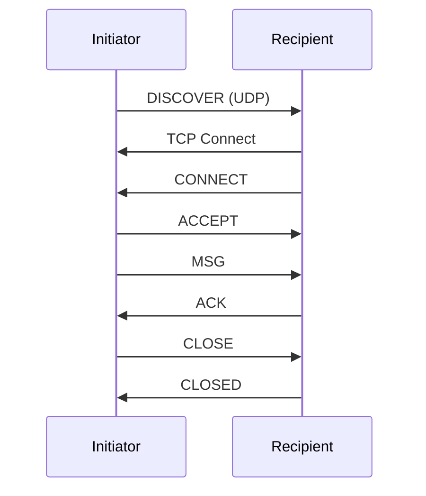
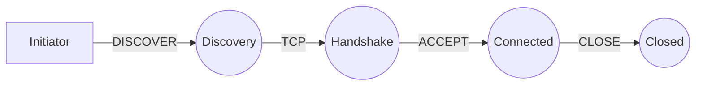

# LNCP Protocol Diagrams

This directory contains visual documentation for the LNCP protocol.

## Diagrams

| File | Description |
|------|-------------|
| [sequence-diagram.md](sequence-diagram.md) | Message sequence flows and error scenarios |
| [state-machine.md](state-machine.md) | Initiator and Recipient state machines |
| [architecture.md](architecture.md) | System architecture, class diagrams, network layers |

## Viewing

These diagrams use [Mermaid](https://mermaid.js.org/) syntax and render automatically on:
- GitHub
- GitLab
- VS Code (with Mermaid extension)
- Any Mermaid-compatible viewer

## Quick Preview

### Communication Flow

### State Overview

