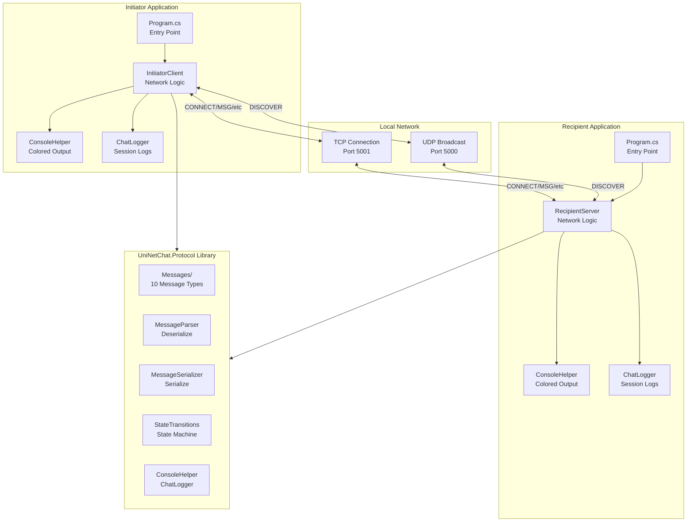
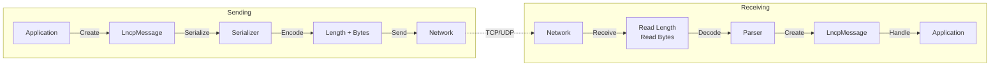
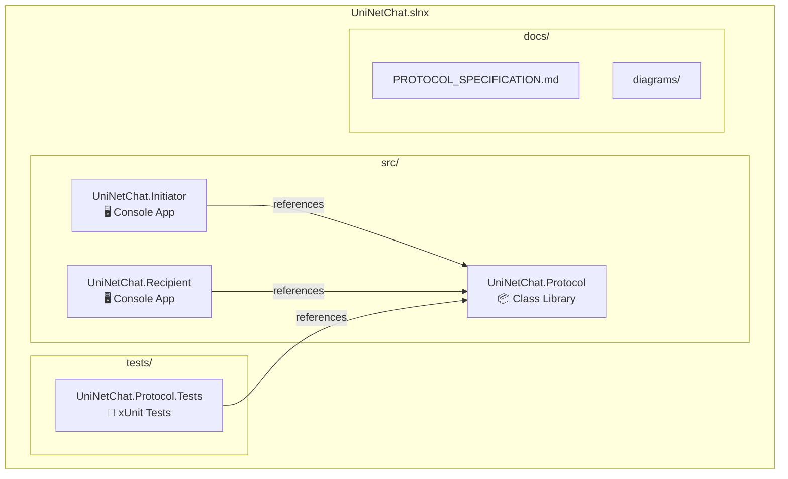
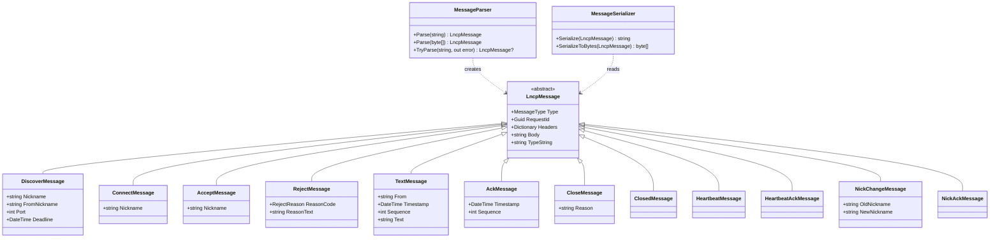
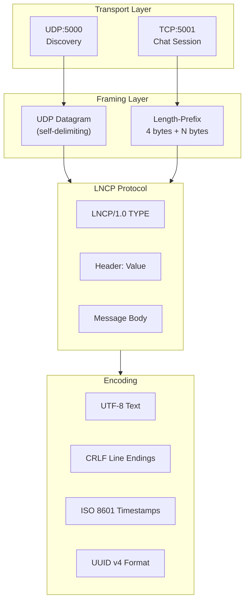

# LNCP Architecture Diagrams

## System Architecture

```mermaid
flowchart TB
    subgraph Network["Local Network"]
        UDP["UDP Broadcast<br/>Port 5000"]
        TCP["TCP Connection<br/>Port 5001"]
    end
    
    subgraph Initiator["Initiator Application"]
        I_Main["Program.cs<br/>Entry Point"]
        I_Client["InitiatorClient<br/>Network Logic"]
        I_Console["ConsoleHelper<br/>Colored Output"]
        I_Logger["ChatLogger<br/>Session Logs"]
    end
    
    subgraph Recipient["Recipient Application"]
        R_Main["Program.cs<br/>Entry Point"]
        R_Server["RecipientServer<br/>Network Logic"]
        R_Console["ConsoleHelper<br/>Colored Output"]
        R_Logger["ChatLogger<br/>Session Logs"]
    end
    
    subgraph Protocol["UniNetChat.Protocol Library"]
        Messages["Messages/<br/>10 Message Types"]
        Parser["MessageParser<br/>Deserialize"]
        Serializer["MessageSerializer<br/>Serialize"]
        States["StateTransitions<br/>State Machine"]
        Helpers["ConsoleHelper<br/>ChatLogger"]
    end
    
    I_Main --> I_Client
    I_Client --> I_Console
    I_Client --> I_Logger
    I_Client --> Protocol
    
    R_Main --> R_Server
    R_Server --> R_Console
    R_Server --> R_Logger
    R_Server --> Protocol
    
    I_Client <-->|DISCOVER| UDP
    UDP <-->|DISCOVER| R_Server
    
    I_Client <-->|CONNECT/MSG/etc| TCP
    TCP <-->|CONNECT/MSG/etc| R_Server
```

## Message Flow Architecture

```mermaid
flowchart LR
    subgraph Sending
        App1["Application"]
        Msg1["LncpMessage"]
        Ser["Serializer"]
        Frame["Length + Bytes"]
        Net1["Network"]
    end
    
    subgraph Receiving
        Net2["Network"]
        Unframe["Read Length<br/>Read Bytes"]
        Parse["Parser"]
        Msg2["LncpMessage"]
        App2["Application"]
    end
    
    App1 -->|Create| Msg1
    Msg1 -->|Serialize| Ser
    Ser -->|Encode| Frame
    Frame -->|Send| Net1
    
    Net2 -->|Receive| Unframe
    Unframe -->|Decode| Parse
    Parse -->|Create| Msg2
    Msg2 -->|Handle| App2
    
    Net1 -.->|TCP/UDP| Net2
```

## Project Structure

```mermaid
flowchart TB
    subgraph Solution["UniNetChat.slnx"]
        subgraph Src["src/"]
            Proto["UniNetChat.Protocol<br/>📦 Class Library"]
            Init["UniNetChat.Initiator<br/>🖥️ Console App"]
            Recip["UniNetChat.Recipient<br/>🖥️ Console App"]
        end
        
        subgraph Tests["tests/"]
            ProtoTests["UniNetChat.Protocol.Tests<br/>🧪 xUnit Tests"]
        end
        
        subgraph Docs["docs/"]
            Spec["PROTOCOL_SPECIFICATION.md"]
            Diagrams["diagrams/"]
        end
    end
    
    Init -->|references| Proto
    Recip -->|references| Proto
    ProtoTests -->|references| Proto
```

## Class Diagram

```mermaid
classDiagram
    class LncpMessage {
        <<abstract>>
        +MessageType Type
        +Guid RequestId
        +Dictionary Headers
        +string Body
        +string TypeString
    }
    
    class DiscoverMessage {
        +string Nickname
        +string FromNickname
        +int Port
        +DateTime Deadline
    }
    
    class ConnectMessage {
        +string Nickname
    }
    
    class AcceptMessage {
        +string Nickname
    }
    
    class RejectMessage {
        +RejectReason ReasonCode
        +string ReasonText
    }
    
    class TextMessage {
        +string From
        +DateTime Timestamp
        +int Sequence
        +string Text
    }
    
    class AckMessage {
        +DateTime Timestamp
        +int Sequence
    }
    
    class CloseMessage {
        +string Reason
    }
    
    class ClosedMessage
    class HeartbeatMessage
    class HeartbeatAckMessage
    class NickChangeMessage {
        +string OldNickname
        +string NewNickname
    }
    class NickAckMessage
    
    LncpMessage <|-- DiscoverMessage
    LncpMessage <|-- ConnectMessage
    LncpMessage <|-- AcceptMessage
    LncpMessage <|-- RejectMessage
    LncpMessage <|-- TextMessage
    LncpMessage <|-- AckMessage
    LncpMessage <|-- CloseMessage
    LncpMessage <|-- ClosedMessage
    LncpMessage <|-- HeartbeatMessage
    LncpMessage <|-- HeartbeatAckMessage
    LncpMessage <|-- NickChangeMessage
    LncpMessage <|-- NickAckMessage
    
    class MessageParser {
        +Parse(string) LncpMessage
        +Parse(byte[]) LncpMessage
        +TryParse(string, out error) LncpMessage?
    }
    
    class MessageSerializer {
        +Serialize(LncpMessage) string
        +SerializeToBytes(LncpMessage) byte[]
    }
    
    MessageParser ..> LncpMessage : creates
    MessageSerializer ..> LncpMessage : reads
```

## Network Layer

```mermaid
flowchart TB
    subgraph Transport["Transport Layer"]
        UDP5000["UDP:5000<br/>Discovery"]
        TCP5001["TCP:5001<br/>Chat Session"]
    end
    
    subgraph Framing["Framing Layer"]
        UDPFrame["UDP Datagram<br/>(self-delimiting)"]
        TCPFrame["Length-Prefix<br/>4 bytes + N bytes"]
    end
    
    subgraph Protocol["LNCP Protocol"]
        Header["LNCP/1.0 TYPE"]
        Headers["Header: Value"]
        Body["Message Body"]
    end
    
    subgraph Encoding["Encoding"]
        UTF8["UTF-8 Text"]
        CRLF["CRLF Line Endings"]
        ISO8601["ISO 8601 Timestamps"]
        UUID["UUID v4 Format"]
    end
    
    UDP5000 --> UDPFrame
    TCP5001 --> TCPFrame
    
    UDPFrame --> Protocol
    TCPFrame --> Protocol
    
    Protocol --> Encoding
```
