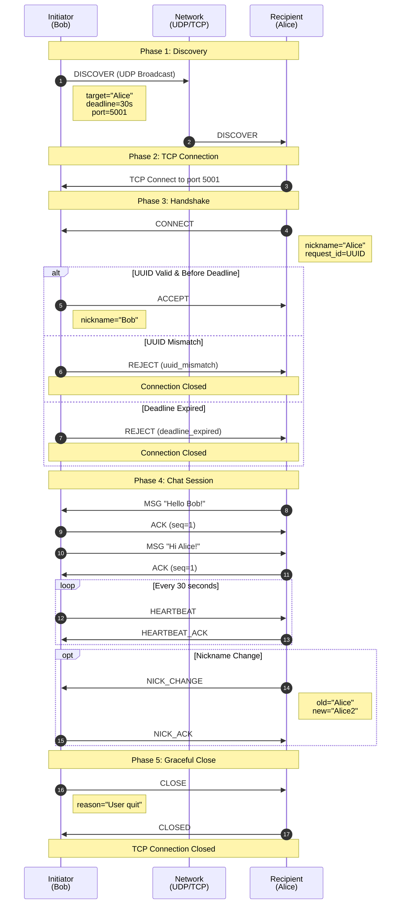
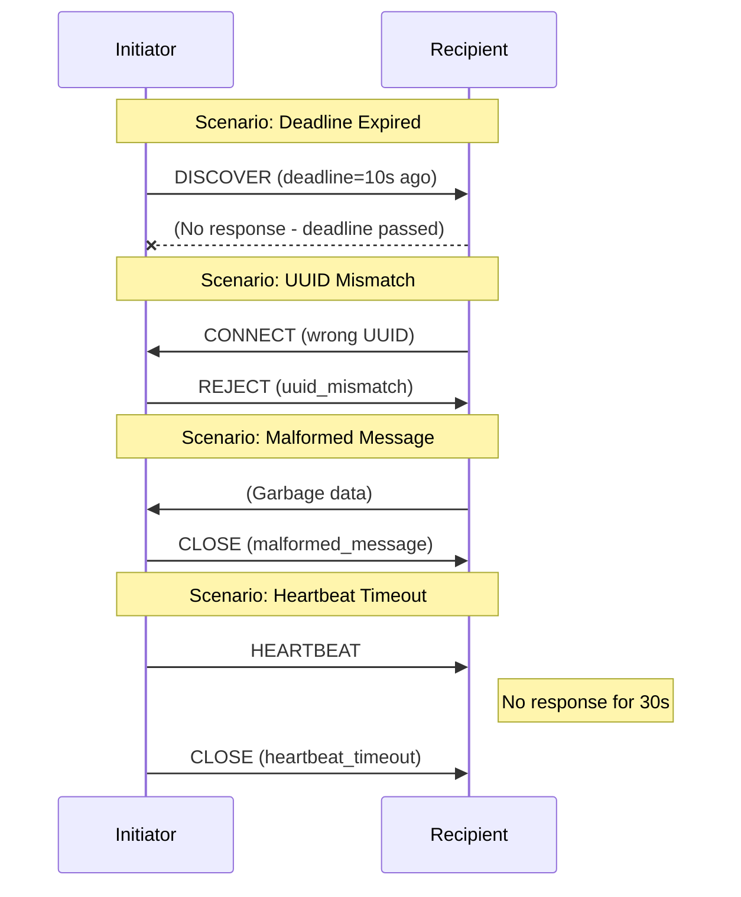

# LNCP Communication Sequence Diagram

## Full Session Flow

```mermaid
sequenceDiagram
    autonumber
    participant I as Initiator<br/>(Bob)
    participant N as Network<br/>(UDP/TCP)
    participant R as Recipient<br/>(Alice)

    Note over I,R: Phase 1: Discovery
    I->>N: DISCOVER (UDP Broadcast)
    Note right of I: target="Alice"<br/>deadline=30s<br/>port=5001
    N->>R: DISCOVER
    
    Note over I,R: Phase 2: TCP Connection
    R->>I: TCP Connect to port 5001
    
    Note over I,R: Phase 3: Handshake
    R->>I: CONNECT
    Note right of R: nickname="Alice"<br/>request_id=UUID
    
    alt UUID Valid & Before Deadline
        I->>R: ACCEPT
        Note right of I: nickname="Bob"
    else UUID Mismatch
        I->>R: REJECT (uuid_mismatch)
        Note over I,R: Connection Closed
    else Deadline Expired
        I->>R: REJECT (deadline_expired)
        Note over I,R: Connection Closed
    end
    
    Note over I,R: Phase 4: Chat Session
    
    R->>I: MSG "Hello Bob!"
    I->>R: ACK (seq=1)
    
    I->>R: MSG "Hi Alice!"
    R->>I: ACK (seq=1)
    
    loop Every 30 seconds
        I->>R: HEARTBEAT
        R->>I: HEARTBEAT_ACK
    end
    
    opt Nickname Change
        R->>I: NICK_CHANGE
        Note right of R: old="Alice"<br/>new="Alice2"
        I->>R: NICK_ACK
    end
    
    Note over I,R: Phase 5: Graceful Close
    
    I->>R: CLOSE
    Note right of I: reason="User quit"
    R->>I: CLOSED
    
    Note over I,R: TCP Connection Closed
```

## Error Scenarios

```mermaid
sequenceDiagram
    participant I as Initiator
    participant R as Recipient

    Note over I,R: Scenario: Deadline Expired
    I->>R: DISCOVER (deadline=10s ago)
    R--xI: (No response - deadline passed)
    
    Note over I,R: Scenario: UUID Mismatch
    R->>I: CONNECT (wrong UUID)
    I->>R: REJECT (uuid_mismatch)
    
    Note over I,R: Scenario: Malformed Message
    R->>I: (Garbage data)
    I->>R: CLOSE (malformed_message)
    
    Note over I,R: Scenario: Heartbeat Timeout
    I->>R: HEARTBEAT
    Note right of R: No response for 30s
    I->>R: CLOSE (heartbeat_timeout)
```
