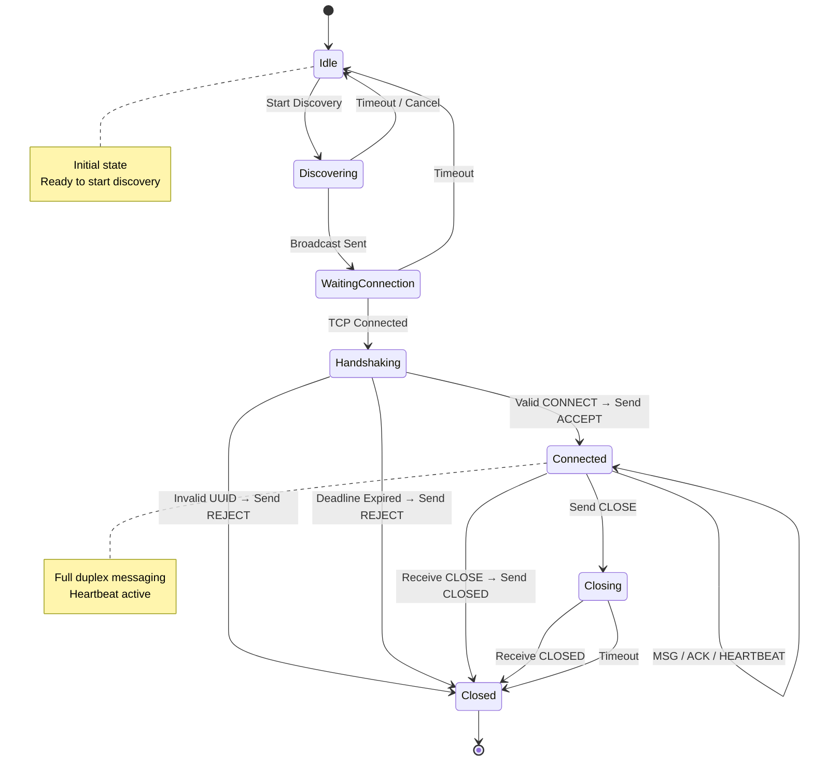
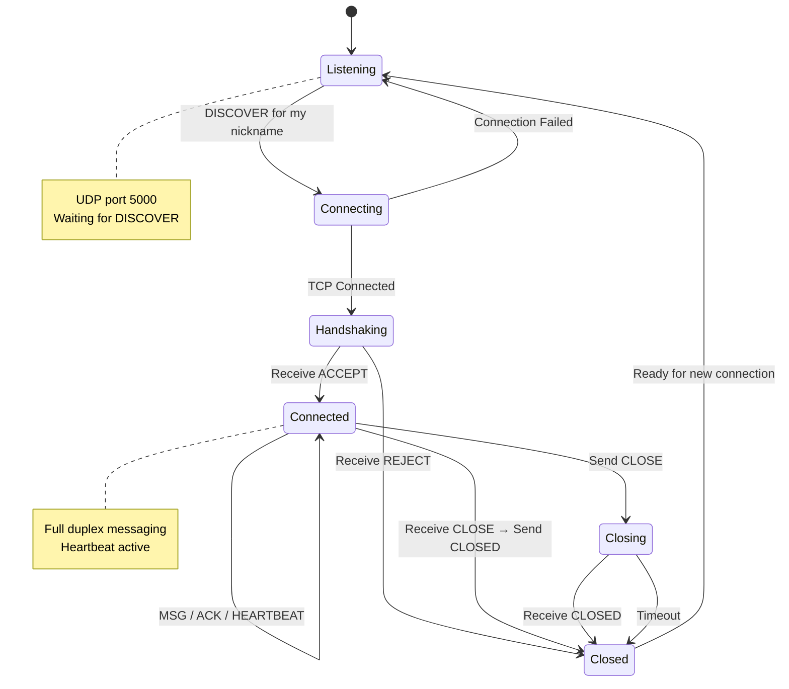
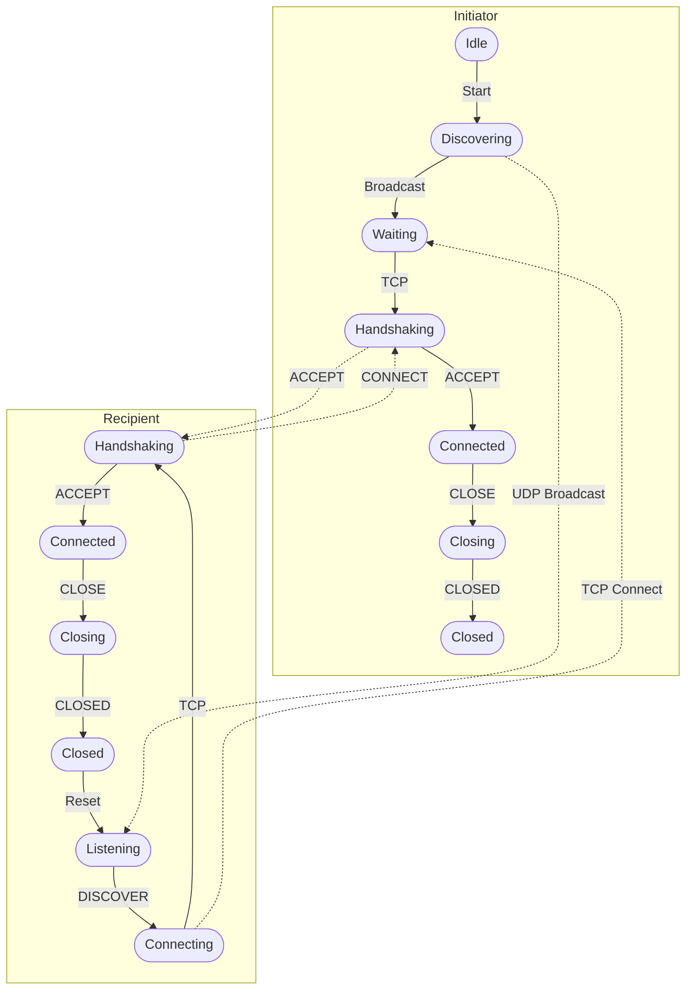

# LNCP State Machine Diagrams

## Initiator State Machine

```mermaid
stateDiagram-v2
    [*] --> Idle
    
    Idle --> Discovering: Start Discovery
    
    Discovering --> WaitingConnection: Broadcast Sent
    Discovering --> Idle: Timeout / Cancel
    
    WaitingConnection --> Handshaking: TCP Connected
    WaitingConnection --> Idle: Timeout
    
    Handshaking --> Connected: Valid CONNECT → Send ACCEPT
    Handshaking --> Closed: Invalid UUID → Send REJECT
    Handshaking --> Closed: Deadline Expired → Send REJECT
    
    Connected --> Connected: MSG / ACK / HEARTBEAT
    Connected --> Closing: Send CLOSE
    Connected --> Closed: Receive CLOSE → Send CLOSED
    
    Closing --> Closed: Receive CLOSED
    Closing --> Closed: Timeout
    
    Closed --> [*]
    
    note right of Idle
        Initial state
        Ready to start discovery
    end note
    
    note right of Connected
        Full duplex messaging
        Heartbeat active
    end note
```

## Recipient State Machine

```mermaid
stateDiagram-v2
    [*] --> Listening
    
    Listening --> Connecting: DISCOVER for my nickname
    
    Connecting --> Handshaking: TCP Connected
    Connecting --> Listening: Connection Failed
    
    Handshaking --> Connected: Receive ACCEPT
    Handshaking --> Closed: Receive REJECT
    
    Connected --> Connected: MSG / ACK / HEARTBEAT
    Connected --> Closing: Send CLOSE
    Connected --> Closed: Receive CLOSE → Send CLOSED
    
    Closing --> Closed: Receive CLOSED
    Closing --> Closed: Timeout
    
    Closed --> Listening: Ready for new connection
    
    note right of Listening
        UDP port 5000
        Waiting for DISCOVER
    end note
    
    note right of Connected
        Full duplex messaging
        Heartbeat active
    end note
```

## Combined View

```mermaid
flowchart TB
    subgraph Initiator
        I_Idle([Idle])
        I_Disc([Discovering])
        I_Wait([Waiting])
        I_Hand([Handshaking])
        I_Conn([Connected])
        I_Close([Closing])
        I_Done([Closed])
        
        I_Idle -->|Start| I_Disc
        I_Disc -->|Broadcast| I_Wait
        I_Wait -->|TCP| I_Hand
        I_Hand -->|ACCEPT| I_Conn
        I_Conn -->|CLOSE| I_Close
        I_Close -->|CLOSED| I_Done
    end
    
    subgraph Recipient
        R_List([Listening])
        R_Conn_ing([Connecting])
        R_Hand([Handshaking])
        R_Conn([Connected])
        R_Close([Closing])
        R_Done([Closed])
        
        R_List -->|DISCOVER| R_Conn_ing
        R_Conn_ing -->|TCP| R_Hand
        R_Hand -->|ACCEPT| R_Conn
        R_Conn -->|CLOSE| R_Close
        R_Close -->|CLOSED| R_Done
        R_Done -->|Reset| R_List
    end
    
    I_Disc -.->|UDP Broadcast| R_List
    R_Conn_ing -.->|TCP Connect| I_Wait
    R_Hand -.->|CONNECT| I_Hand
    I_Hand -.->|ACCEPT| R_Hand
```
